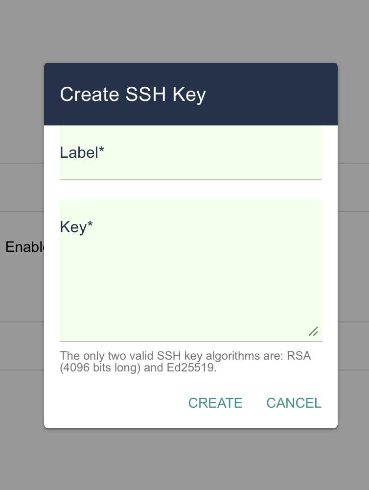

# Connecting to Deucalion

To access the Deucalion supercomputer, you must first link your local machine to the cluster using SSH (Secure Shell) keys.

## Generate your SSH keys

Start by generating an SSH key pair as detailed below.

An SSH key pair can be generated using a Linux, macOS, Windows PowerShell terminal. For example, you can use the following command to generate an ed25519 key:

```bash
ssh-keygen -t ed25519
```

Please choose a secure passphrase. It should be at least 8 (preferably 12) characters long and should contain numbers, letters and special characters. Do not leave the passphrase empty.

After that an SSH key pair is created, i.e. a pair of files containing the public and private keys, e.g. files named `id_ed25519_macc` (the private key) and `id_ed25519_macc.pub` (the public key) in your `/home/username/.ssh/ directory`.

**The private key should never be shared with anyone!!!** It should also be stored only on your local computer (public key can be safely stored in cloud services). Protect it with a good password! Otherwise, anyone with access to the file system can steal your SSH key.

### Register your public key

Now that you have generated your key pair, you need to register your public key in your Deucalion User Portal settings.

To register your key, click on the Settings item of the menu on the right as shown in the figure below. Then copy and paste the content of your public key file in the text area, or upload the file, and click the Save button.



Please note that there might be up to a 30 minute delay between adding your key and being able to access Deucalion via ssh.

## Using SSH

Once you have completed the steps to setting up SSH key pair you can connect to Deucalion via SSH using the folling command:

```bash
ssh -i <path-to-private-key> <username>@login.deucalion.macc.fccn.pt
```

where `<path-to-private-key>` is the path to the file which contains your private key and `<username>` is you own username.

> **Tip** 💡 To simplify the login procedure you can define a shorthand alias for the connection parameters (user, host, private key). You may add the following declaration to the SSH user configuration file on your system (~/.ssh/config, create it if it does not already exist):

```bash
Host deucalion
   Hostname login.deucalion.macc.fccn.pt
   User <username>
   ForwardAgent no
   IdentityFile ~/.ssh/id_rsa_macc
```

You will then be able to connect to Deucalion by simply:

```bash
ssh deucalion
```

## Using Remote Explorer (VSCode)

To simplify the file operations between your local PC and the remote login node, you may want to access Deucalion using the Remore Explorer extension offered by Visual Studio Code.

If not installer, search for "Remote Explorer" in the `Extensions` options and install `Remote Explorer`.

Once you have configured the hostname `deucalion` on the SSH configuration file (~/.ssh/config), you need to connect to it via the extension.